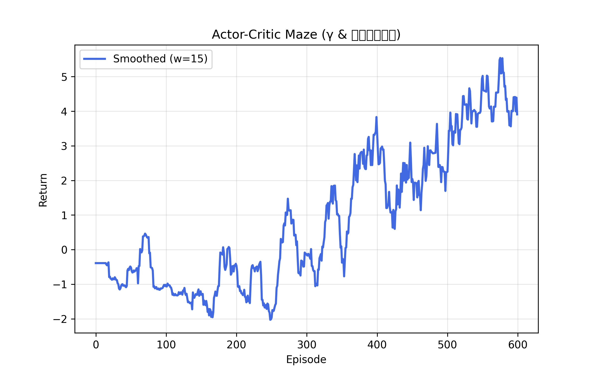

---

# 🧭 Actor-Critic Maze (稳定版)

> 🎯 一个基于 **PyTorch + Tkinter** 的可视化强化学习迷宫环境，实现 **Actor-Critic 算法（带动态 γ 与熵衰减机制）**。
> 智能体通过学习逐步掌握避障并抵达目标点的策略。

---

## 🌟 项目简介

本项目实现了一个经典的 **4×4 迷宫强化学习环境**，红色小方块为智能体，黑格为障碍，黄色圆点为目标。

使用 **Actor-Critic 算法（策略梯度 + 时序差分）** 实现训练，
并通过：

* BFS 势函数奖励（鼓励靠近终点）；
* 动态 γ 衰减（平衡远近奖励）；
* 动态熵系数衰减（前期探索多，后期稳定收敛）；
  使智能体在 600 回合内学会稳定到达终点。

---

## 🧠 算法原理

**Actor-Critic** 结合了策略梯度（Policy Gradient）与时序差分（Temporal Difference, TD）思想：

$$
\text{TD Target:} \quad y_t = r_t + \gamma V(s_{t+1})
$$

$$
\text{TD Error:} \quad \delta_t = y_t - V(s_t)
$$

$$
\text{Policy Update:} \quad \nabla_\theta J \propto \delta_t \nabla_\theta \log \pi_\theta(a_t|s_t)
$$

- **Actor**：学习策略 \( \pi(a|s) \)，决定动作选择；
- **Critic**：估计价值函数 \( V(s) \)，提供更新信号；
- **熵正则项 (Entropy)**：鼓励分布多样性，促进探索。

---

## 🏗️ 项目结构

```
ActorCritic-Maze/
│
├── ActorCritic_Maze.py     # 主程序（环境 + 网络 + 训练器）
├── results/                # 训练曲线图像自动保存位置
│   └── maze_plot.png
└── README.md               # 项目说明文件（本文件）
```

---

## ⚙️ 环境依赖

```bash
# Python >= 3.8
pip install torch matplotlib numpy
```

Tkinter 一般随 Python 自带，如无请安装：

* Windows: 自带
* macOS: `brew install python-tk`
* Ubuntu: `sudo apt-get install python3-tk`

---

## 🚀 运行方式

直接执行：

```bash
python ActorCritic_Maze.py
```

程序会自动弹出一个 Tkinter 可视化窗口，
训练结束后会在 `results/maze_plot.png` 中生成回报曲线。

---

## 🎮 环境说明

| 元素     | 颜色      | 奖励机制              |
| ------ | ------- | ----------------- |
| 起点     | 🔴 红色方块 | 初始位置              |
| 终点     | 🟡 黄色圆点 | +5.0              |
| 障碍     | ⚫ 黑色方块  | -1.0              |
| 空地     | ⚪ 白色格子  | 每步 -0.01          |
| 势函数奖励  |         | 离终点更近 +0.25 × Δ距离 |
| 重复访问惩罚 |         | 超过 4 次访问 -0.01    |

理论最大奖励 ≈ 5.8~6.0，训练后收敛到 4.5~5.0 属于理想状态。

---

## 🔧 主要参数说明

| 参数名            | 含义         | 默认值         |
| -------------- | ---------- | ----------- |
| `actor_lr`     | 策略网络学习率    | 1e-3        |
| `critic_lr`    | 价值网络学习率    | 2e-3        |
| `gamma`        | 折扣因子（动态衰减） | 0.9 → 0.85  |
| `entropy_coef` | 熵权重（动态衰减）  | 0.05 → 0.01 |
| `max_episodes` | 训练回合数      | 600         |
| `max_steps`    | 每回合最大步数    | 80          |

---

## 📈 实验结果

训练曲线示例：



> * 前期（0~250 回合）：智能体随机探索，回报为负；
> * 中期（250~400 回合）：势函数与奖励信号引导学习路径；
> * 后期（400~600 回合）：熵衰减锁定为 0.01，策略稳定收敛；
> * 最终平均回报 ≈ 4.5~5.0，接近理论最优。

---

## 🔍 熵衰减策略比较

| 策略           | 描述                  | 特点            |
| ------------ | ------------------- | ------------- |
| `0.998`      | 衰减慢                 | 后期仍随机，曲线抖动明显  |
| `0.995`      | 稍快                  | 收敛稳定但略早锁定策略   |
| **Proposed** | `250→400` 指数衰减 + 截断 | 平衡探索与稳定性，收敛最快 |

**可视化对比：**

```python
# 见 README 图示代码（entropy coefficient comparison）
```

---

## 📚 实验结论

* **动态 γ 与熵衰减** 可显著提高收敛稳定性；
* **分段式熵调度**（250→400 回合衰减 + 400 后固定）能在中后期平衡探索与利用；
* 训练 600 回合后，智能体能稳定找到最短路径并避开障碍。

---

## 💡 可选优化方向

| 优化项                        | 说明                     |
| -------------------------- | ---------------------- |
| 调整 γ 衰减速率                  | 后期固定 0.88~0.9 可进一步平滑曲线 |
| 加入 Advantage Normalization | 稳定 TD 更新               |
| 使用更深的网络结构                  | 提升泛化性                  |
| 使用 PPO / A2C 替代            | 提升策略稳定性                |

---

## 🧾 引用

若你在论文或项目中使用此代码，请引用以下格式：

```
@software{actor_critic_maze,
  author = {DY},
  title = {Actor-Critic Maze (Stable Version)},
  year = {2025},
  url = {https://github.com/yourname/ActorCritic-Maze}
}
```

---

## 💬 联系与讨论

如果你想进一步研究 BFS 势函数奖励、动态 γ 衰减或在更复杂迷宫环境上测试算法，欢迎讨论或提交 issue！

---

**作者**：DY
**环境**：Python 3.10, PyTorch 2.2, Tkinter, Matplotlib
**最后更新**：2025.11

---
